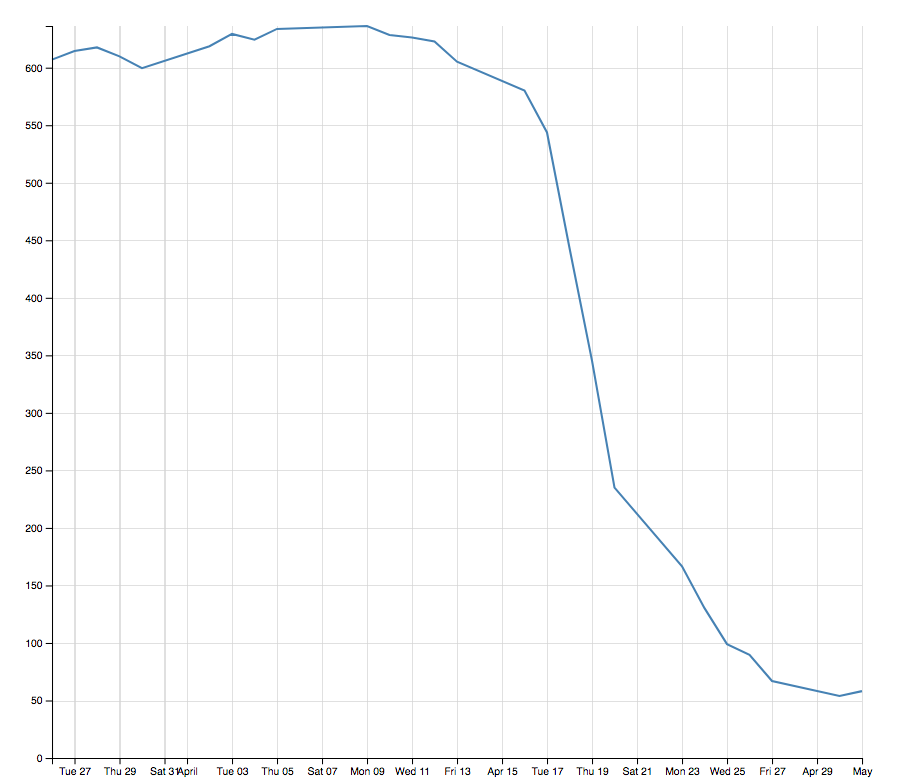

# Line

Import the **LineModule** from **ng-d3** 

```javascript
import { LineModule } from 'ng-d3';
//...
@NgModule({
imports: [
  LineModule,
]});
```


## Properties

| Name        | Type           | Default  | Description |
| ------------- |:-------------:| -----:| -------------:|
| labels        | Date[]        | [] | Array of labels. Currently support **dates** only. |
| data        | any[]        | [] | Array of values. |


## Example

```javascript
const labels = [ '1-May-12', '30-Apr-12', '27-Apr-12', '26-Apr-12', '25-Apr-12', '24-Apr-12', '23-Apr-12', '20-Apr-12', '19-Apr-12', '18-Apr-12', '17-Apr-12', '16-Apr-12', '13-Apr-12', '12-Apr-12', '11-Apr-12', '10-Apr-12', '9-Apr-12', '5-Apr-12', '4-Apr-12', '3-Apr-12', '2-Apr-12', '30-Mar-12', '29-Mar-12', '28-Mar-12', '27-Mar-12', '26-Mar-12' ];
const data = [ 58.13, 53.98, 67, 89.7, 99, 130.28, 166.7, 234.98, 345.44, 443.34, 543.7, 580.13, 605.23, 622.77, 626.2, 628.44, 636.23, 633.68, 624.31, 629.32, 618.63, 599.55, 609.86, 617.62, 614.48, 606.98 ];
```

```html
<ng-line [labels]="labels" [data]="data"></ng-line>
```


