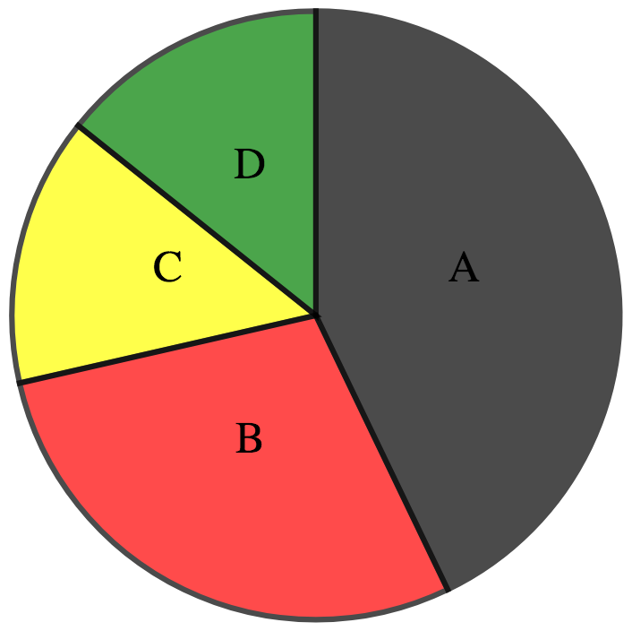

# Pie

# Bar

Import the **BarModule** from **ng-d3** 

```javascript
import { BarModule } from 'ng-d3';
//...
@NgModule({
imports: [
  BarModule,
]});
```


## Properties

| Name        | Type           | Default  | Description |
| ------------- |:-------------:| -----:| -------------:|
| labels        | string[]        | [] | Array of labels. |
| data        | string[]        | [] | Array of values. |
| backgroundColors        | any        | d3.schemeSet2 | sections background color range.  |


## Example

```javascript
const labels =  [ '1', '2', '3', '4', '5', '6', '7', '8', '9', '10', '11', '12', '13', '14', '15', '16', '17', '18', '19', '20', '50' ];
const data = [ '850', '740', '900', '1070', '930', '850', '950', '980', '980', '880', '1000', '980', '930', '650', '760', '810', '1000', '1000', '960', '960', '2000' ];
```

```html
<ng-pie [labels]="labels" [data]="data"></ng-pie>
```


